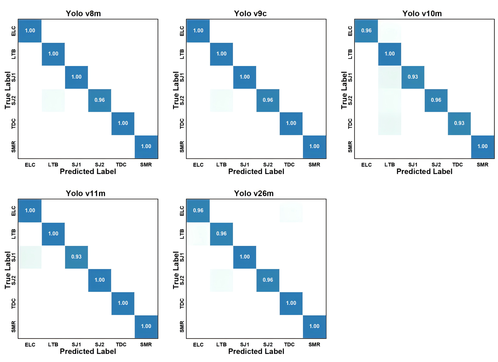
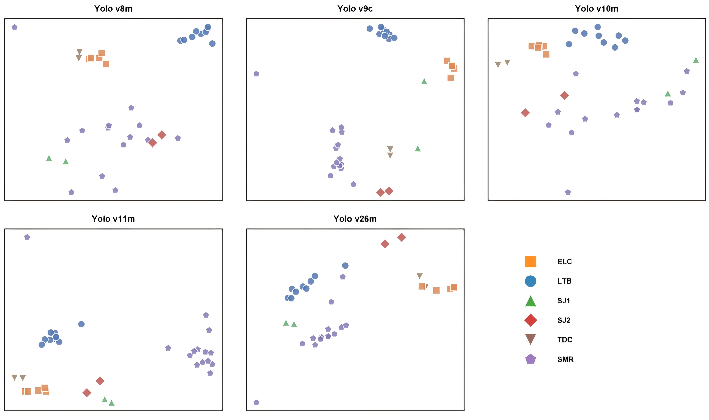

# FD-TamperBoard: A Tampering Features Dataset of Fuel Dispenser PCBs for Illicit Metering Detection

<p align="center">
  <a href="https://opensource.org/licenses/MIT"></a>
  <a href="https://github.com/NIM-NMDC/FD-TamperBoard"></a>
  <a href="https://github.com/ultralytics/ultralytics"></a>
  <a href="https://pytorch.org/"></a>
  <a href="https://opencv.org/"></a>
</p>

**FD-TamperBoard** is a high-quality, cross-brand image dataset of assembled printed circuit boards (PCBs) from fuel dispensers, constructed to support computer-vision-based research on illicit metering detection and anti-fraud inspection. All samples were collected from real-world law enforcement operations and verified by domain experts.

<p align="center">
  
</p>

*Figure 1. Workflow for dataset establishment. (a) Data collection. (b) Data filtering, preprocessing, and image database formation. (c) Image classification and annotation. (d) Development of AI models for intelligent anti-tampering feature detection on fuel dispenser PCBs using the FD-TamperBoard dataset.*

> **📢 Notice**: Both the **complete dataset** and **source code** will be fully released upon the official acceptance of our paper.

---

## 📊 Dataset Overview

| Property | Description |
| :--- | :--- |
| **Total Images** | **189** high-resolution PCB images |
| **Image Resolution** | 7008 × 4672 pixels (Sony ILCE-7CM2) |
| **Brands Covered** | **5** mainstream domestic fuel dispenser brands |
| **Tampering Categories** | **6 Classes**: ELC, LTB, SJ1, SJ2, TDC, SMR |
| **Total Annotated Instances** | **199** bounding box instances |
| **Annotation Format** | YOLO (`.txt` per image, normalized bounding boxes) |
| **Image Format** | JPG |
| **Preprocessing** | Lens distortion correction + four-point homography rectification |
| **Validation Protocol** | 5-fold cross-validation |

---

## 🔍 Tampering Feature Categories

The dataset covers **6 types of tampering features** across 5 anonymized brands (Brand A–E), ranging from coarse-grained hardware additions to fine-grained circuit modifications:

| Category | Full Name | Brand | Instances | Description |
| :---: | :--- | :---: | :---: | :--- |
| **ELC** | Extra Language Chip | A, B, C, D, E | 51 | Additional chip illegally installed in place of or attached to the original language expansion chip |
| **LTB** | Left Terminal Block | A | 25 | Tampered left terminal block component |
| **SJ1** | Solder Joint 1 | B | 14 | Tampered solder joint modification (type 1) |
| **SJ2** | Solder Joint 2 | B | 23 | Tampered solder joint modification (type 2) |
| **TDC** | Tampered Decoding Chip | B | 72 | Illegally installed or modified decoding chip |
| **SMR** | Surface Mount Resistor | C | 14 | Tampered surface-mount resistor alteration |
| | | **Total** | **199** | |

<p align="center">
  
</p>

*Figure 3. Representative examples of annotated tampering features in the FD-TamperBoard dataset. (a) Extra Language Chip (ELC). (b) Left Terminal Block (LTB). (c) Solder Joint 1 (SJ1, yellow) and Solder Joint 2 (SJ2, purple). (d) Tampered Decoding Chip (TDC). (e) Surface Mount Resistor (SMR).*

---

## 🗂️ Dataset Structure

```
FD-TamperBoard/
├── images/          # 189 preprocessed high-resolution PCB images (.jpg)
├── labels/          # Corresponding YOLO-format annotation files (.txt)
├── classes.txt      # Class name definitions
└── fig/
    ├── workflow.png           # Figure 1: Dataset establishment workflow
    ├── tampering_features.png # Figure 3: Annotated tampering feature examples
    ├── confusion_matrix.png   # Figure 4: Confusion matrix (5-fold aggregated)
    └── tsne.png               # Figure 5: t-SNE feature embeddings
```

Each label file follows the YOLO format:
```
<class_id> <x_center> <y_center> <width> <height>
```
All coordinates are normalized to `[0, 1]` relative to the image dimensions. Files are named with a unified convention: `NNN_BrandX_TYPE.ext`.

---

## ⚙️ Data Collection & Preprocessing

**Acquisition Equipment**
- Camera: Sony ILCE-7CM2
- Lens: TAMRON 35–50 mm F/2.8 Di III VXD
- Resolution: 7008 × 4672 pixels, saved in JPG format
- Environment: Indoor, natural light, front-facing PCB view

**Preprocessing Pipeline**
1. **Lens distortion correction** — Zhang's calibration method applied using EXIF focal length metadata to correct barrel/pincushion distortion
2. **Perspective rectification** — Canny edge detection + Douglas-Peucker polygon approximation to extract four PCB corners; 3×3 homography matrix computed to produce a standardized orthographic top-down view
3. **Background cropping** — Morphological-based algorithm to crop out invalid padding and retain only the valid PCB area

**Annotation Quality Control**
- Stage 1: PCB-repair technicians annotate bounding boxes for tampering features
- Stage 2: Independent annotators review category attributes and tampering confidence levels
- Stage 3: Panel of three senior metrology experts conducts point-to-point arbitration until **100% consensus** is achieved on all instances

---

## 🏆 Benchmark Results

All experiments were conducted on a workstation with an **NVIDIA Tesla V100S GPU (32 GB VRAM)** using the **PyTorch** framework, with **5-fold cross-validation**.

**Training Configuration:** SGD optimizer · lr = 0.01 · batch size = 4 · 50 epochs per fold

### 1. Object Detection Performance

| Method | mAP@0.5 | mAP@0.5:0.95 | Recall | Precision | **Weights** |
| :--- | :---: | :---: | :---: | :---: | :---: |
| **YOLOv8m** | **0.9922 ± 0.0055** | 0.8028 ± 0.0384 | **0.9926 ± 0.0104** | 0.9479 ± 0.0251 | [🔗 Download](https://aistudio.baidu.com/dataset/detail/373716/intro) |
| **YOLOv9c** | 0.9866 ± 0.0103 | **0.8115 ± 0.0278** | 0.9833 ± 0.0222 | **0.9607 ± 0.0147** | [🔗 Download](https://aistudio.baidu.com/dataset/detail/373716/intro) |
| **YOLOv10m** | 0.9810 ± 0.0094 | 0.7991 ± 0.0226 | 0.9341 ± 0.0413 | 0.9330 ± 0.0323 | [🔗 Download](https://aistudio.baidu.com/dataset/detail/373716/intro) |
| **YOLOv11m** | 0.9846 ± 0.0209 | 0.7916 ± 0.0313 | 0.9835 ± 0.0222 | 0.9481 ± 0.0131 | [🔗 Download](https://aistudio.baidu.com/dataset/detail/373716/intro) |
| **YOLOv26m** | 0.9862 ± 0.0115 | 0.8001 ± 0.0174 | 0.9508 ± 0.0395 | 0.9463 ± 0.0080 | [🔗 Download](https://aistudio.baidu.com/dataset/detail/373716/intro) |

> All five baseline models exceeded **mAP@0.5 = 0.98**, confirming the high annotation quality and dataset reliability.

### 2. Classification & Diagnostics Performance

*Derived from detection results to evaluate fault diagnosis reliability (5-fold cross-validation).*

| Method | Accuracy | Specificity | Sensitivity | Precision | F1 Score | Kappa | **Weights** |
| :--- | :---: | :---: | :---: | :---: | :---: | :---: | :---: |
| **YOLOv8m** | — | — | — | — | — | — | [🔗 Download](https://aistudio.baidu.com/dataset/detail/373716/intro) |
| **YOLOv9c** | — | — | — | — | — | — | [🔗 Download](https://aistudio.baidu.com/dataset/detail/373716/intro) |
| **YOLOv10m** | — | — | — | — | — | — | [🔗 Download](https://aistudio.baidu.com/dataset/detail/373716/intro) |
| **YOLOv11m** | — | — | — | — | — | — | [🔗 Download](https://aistudio.baidu.com/dataset/detail/373716/intro) |
| **YOLOv26m** | — | — | — | — | — | — | [🔗 Download](https://aistudio.baidu.com/dataset/detail/373716/intro) |

> ⚠️ Classification metrics (Accuracy, Specificity, Sensitivity, F1, Kappa) and download links will be filled in upon paper acceptance.

## 📈 Visualization

<p align="center">
  
</p>

*Figure 4. Confusion matrix of tampering feature predictions aggregated over 5-fold cross-validation.*

<p align="center">
  
</p>

*Figure 5. t-SNE visualizations of high-dimensional feature embeddings for tampering feature classes on the first fold (one panel per YOLO model).*

---

## 🚀 Quick Start

### Requirements

```bash
pip install ultralytics opencv-python
```

### Training with YOLO

```python
from ultralytics import YOLO

model = YOLO('yolov8m.pt')
model.train(
    data='FD-TamperBoard.yaml',
    epochs=50,
    batch=4,
    imgsz=640,
    optimizer='SGD',
    lr0=0.01
)
```

### Dataset YAML (`FD-TamperBoard.yaml`)

```yaml
path: ./FD-TamperBoard
train: images
val: images

nc: 6
names: ['ELC', 'LTB', 'SJ1', 'SJ2', 'TDC', 'SMR']
```

---

## 📜 Citation

If you use FD-TamperBoard in your research, please cite our paper:

```bibtex
@article{FD-TamperBoard2026,
  title   = {FD-TamperBoard: A Tampering Features Dataset of Fuel Dispenser PCBs for Illicit Metering Detection},
  author  = {Pei, Chenbo and Wang, Bin and Liu, Zilong and Xiong, Xingchuang and Cao, Zhanshuo},
  journal = {Data},
  year    = {2026},
  note    = {Submitted}
}
```

---

## 👥 Authors & Affiliation

- **Chenbo Pei** · **Bin Wang** · **Zilong Liu\*** · **Xingchuang Xiong** · **Zhanshuo Cao**
- Center for Metrology Scientific Data, National Institute of Metrology, Beijing 100029, China
- National Metrology Data Center, Beijing 100029, China
- Key Laboratory of Metrology Digitalization and Digital Metrology, State Administration for Market Regulation, Beijing 100029, China

\*Corresponding author: liuzl@nim.ac.cn

---

## 📄 License

This dataset is released under the [MIT License](https://opensource.org/licenses/MIT). It is intended solely for academic research and non-commercial use.
